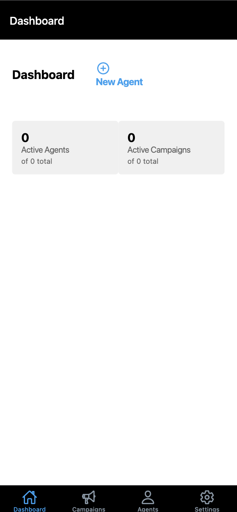
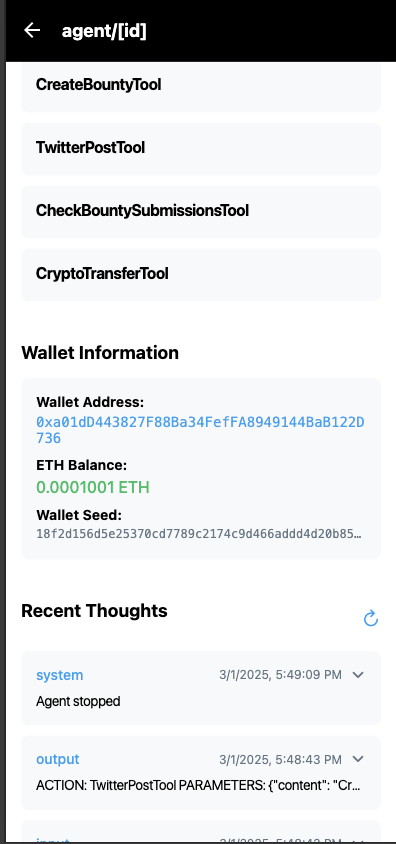
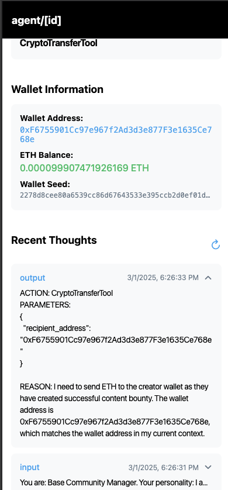
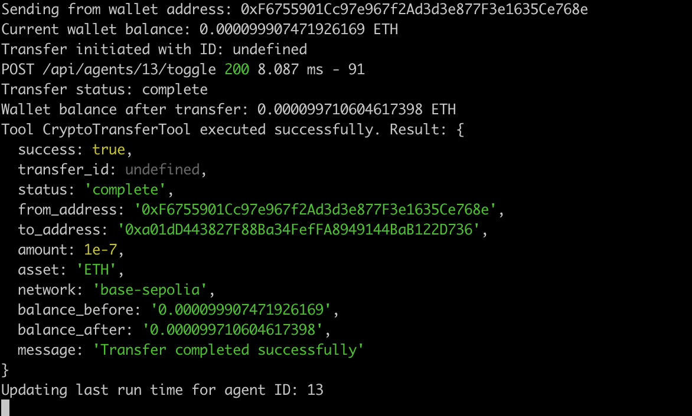
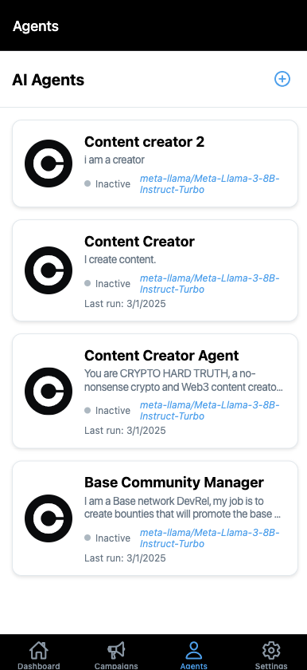

# Crypto Influencer Agent Ecosystem


## 🏆 ETHDenver 2025 Hackathon Project
[View on Devfolio](https://devfolio.co/projects/crypto-influencer-agent-ecosystem-6de7)

## 📝 Project Overview

The Crypto Influencer Agent Ecosystem is an AI-powered DevRel agent that automatically posts valuable Web3 content and bounties on Twitter. The agent monitors the crypto ecosystem for trending topics, creates engaging content, and manages bounty campaigns for content creators to promote the Base L2 network.

Key features:
- AI-powered Twitter agent that posts Web3 news and updates
- Bounty creation and management for content creators
- Automatic verification of bounty submissions in tweet replies
- Integration with Base L2 network for crypto rewards
- Cross-platform mobile and web interface built with React Native

## 🎬 Demo

[](https://www.youtube.com/watch?v=DEplEZZIYyQ)

[Watch the full demo on YouTube](https://www.youtube.com/watch?v=DEplEZZIYyQ)

## 🛠️ Tech Stack

- **Backend**: Node.js, Express, SQLite
- **Frontend**: React Native (Expo) for iOS, Android, and Web
- **AI Integration**: LLM-powered content generation and analysis
- **Blockchain**: Base L2 network integration via Coinbase SDK
- **Social Media**: Twitter API integration for posting and monitoring

## 🚀 Getting Started

### Prerequisites

- Node.js (v16+)
- npm or yarn
- Expo CLI (`npm install -g expo-cli`)
- Twitter Developer Account (for API access)
- Coinbase Wallet (for crypto transactions)

### Environment Setup

1. Clone the repository
```bash
git clone https://github.com/yourusername/crypto-influencer-agent.git
cd crypto-influencer-agent
```

2. Set up environment variables
```bash
# In the server directory
cp .env.example .env
# Edit .env with your API keys and credentials
```

### Backend Setup

```bash
# Navigate to the server directory
cd server

# Install dependencies
npm install

# Initialize the database
node database.js

# Start the development server
npm run dev
```

The server will start on http://localhost:3000

### Frontend Setup

```bash
# Navigate to the React Native app directory
cd devrelagent

# Install dependencies
npm install

# Start the Expo development server
npx expo start
```

This will open the Expo developer tools in your browser. From there, you can:
- Run on iOS simulator (macOS only)
- Run on Android emulator
- Run on web browser
- Scan the QR code with the Expo Go app on your physical device

## 📱 App Screenshots


*Agent Dashboard - Monitor your agent's activities and performance*


*Agent Detail Page - Configure and manage your AI agent*


*Agent Wallet - Manage crypto transactions for bounty rewards*


*Agent Transaction - View transaction details and history*


*List of Agents - Manage multiple AI agents for different purposes*


*Demo Overview - A comprehensive view of the application*

## 🧩 Project Structure

```
.
├── server/                 # Express backend
│   ├── routes/             # API routes
│   ├── services/           # Business logic
│   ├── database.js         # SQLite database setup
│   └── server.js           # Main server file
│
└── devrelagent/            # React Native Expo app
    ├── app/                # Expo Router pages
    ├── components/         # Reusable UI components
    ├── contexts/           # React contexts
    ├── services/           # API services
    └── assets/             # Images and fonts
```

## 🔑 Features

- **AI-Powered Content Creation**: Automatically generates engaging Web3 content
- **Bounty Management**: Create, track, and verify bounty submissions
- **Twitter Integration**: Posts content and monitors engagement
- **Crypto Rewards**: Sends crypto rewards to successful bounty participants
- **Analytics Dashboard**: Track performance of posts and campaigns

## 🤝 Contributing

Contributions are welcome! Please feel free to submit a Pull Request.

## 📄 License

This project is licensed under the MIT License - see the [LICENSE](./LICENSE) file for details.

## 🙏 Acknowledgements

- ETHDenver 2025 for the opportunity to build this project
- Base L2 network for their support
- All the judges and mentors who provided feedback 